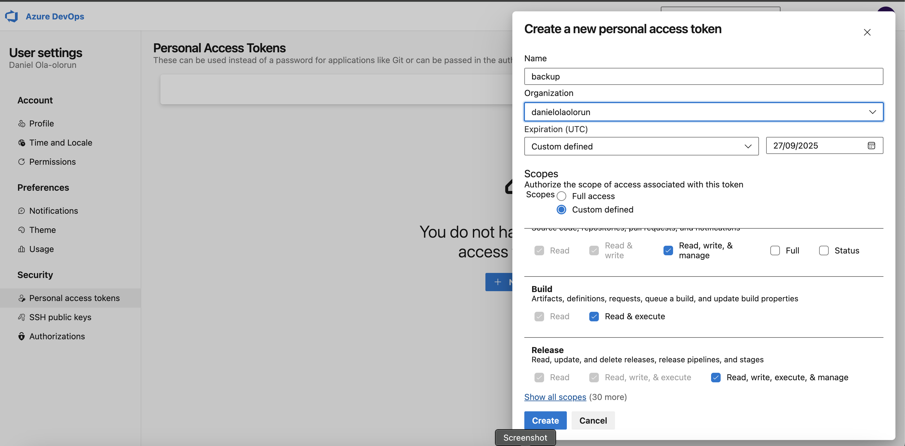
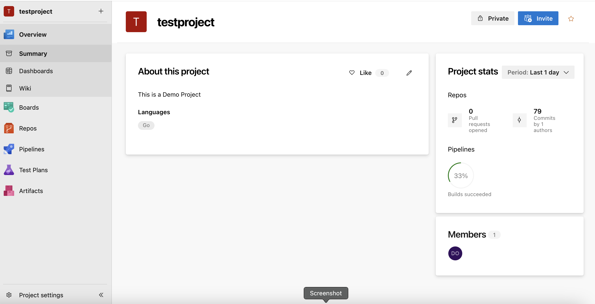
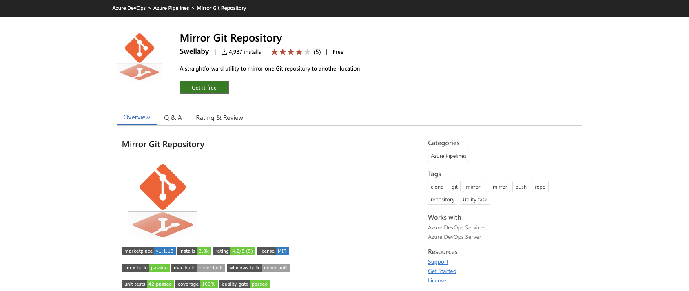
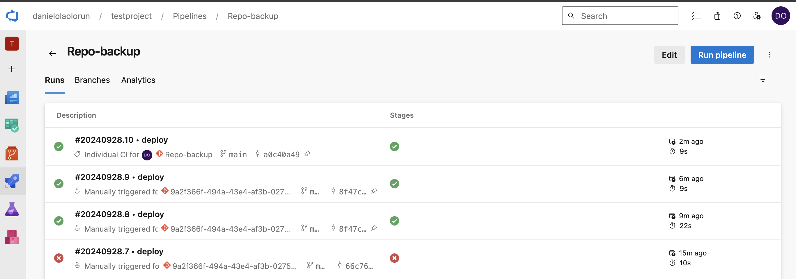
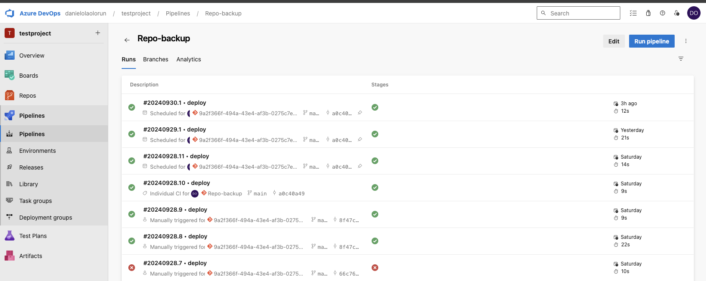

 ### INTRODUCTION 

 

 A task that is commonly undertaken by Infrastructure and DevOps engineers is to keep consistent and replicable backups of their code repostories for disaster recovery purposes. In this article, i will walk through how to backup our git repostories by replicating our repos from github to azure devops repos. It should be well noted that this task can also be carried out in reverse, i.e backing up an azure devops repostory to github.

 Note: this walkthrough requires a basic understanding of version control systems and CI/CD workflows, specifically Git and Azure DevOps pipelines.

 Requirements
 1. Github account
 2. Github PAT
 3. Azure Devops account
 4. Azure Devops PAT
 5. Existing code Repository

 Optional (Recommended for enterprise organizations)
 1. Github Enterprise Service Account  
 2. Azure DevOps service account 

 ## Summary
In this walkthrough, we will build an azure devops pipeline workflow (add link to azure devops pipeline) that will clone all existing specified git repositories hosted in github and replicate them to identical repositories hosted in a Azure devops service project. You can find a link to the azure devops pipeline yaml file here in github. We will also configure the pipeline to run the workflow daily, i.e the backup will be carried out at a certain time every day, in our case, this will be 7pm GMT+1. lastly, it will send out a success or failure notification via email once the triggered workflow runs so we are always in the know if something ever goes wrong. 

##add link to azure devops documentation and github docs

##azure link to pipeline code hosted in github

 ## Steps 
1. Create Github PAT
2. Create azure devops PAT
3. Import existing github repostitory into azure devops repo
4. Create repo-backup repository
5. Create azure devops repo-backup pipeline
6. Add secret pipeline variables with PATs to workflow
7. Manually trigger workflow to test
8. Profit!

Login into your github account and create a PAT 

It is good practice to regularly rotate secrets so we'll set the expiration day and the maximum days github will let us set is one year so we do that. we will grant the token the following scopes

Repo(full control of private repositories)
User:email (access user emails addresses(read-oly))
read:project (read access of projects)

Generate the token

go to your azure devops service project, go to user settings and generate a personal access token with 1 year expiry and custom defined scope with the following scopes

Code:
Read, write & manage
Build:
Read and execute
Release:
read, write, execute, & manage

generate your PAT

To build our pipeline, we are going to be using the vsts mirror git repository utility by Swellaby https://marketplace.visualstudio.com/items?itemName=swellaby.mirror-git-repository
.

First and foremost, we should clone our target repository to azure devops, this is to ensure that when our pipeline runs, it will have a target(repo) to replicate the repository to. We could include a step to create a repository if it does not exist in azure devops repos, but that is out of the scope of this article. 

Go to azure devops repos, and click "import a repository" button.
 
If you dont see azure devops repos, make sure it is enabled for your project in the project settings.  
You will be required to specify a url to an existing repository and may also require you to authenticate with your username and the PAT we initially created. 
I am going to be using this repository for this demo "https://github.com/Ola-Daniel/learn-golang-with-test" which is a private repo so we'll need to authenticate. 

If everything goes well, you will see a sucess message in your console.
Now, we can proceed to configuring our pipeline. 

We will create a new repository called "repo-backup". Initialize this repo with an empty readme file. this is were our pipeline code will live

now go to azure pipeline, click the create a pipeline button. 

on the "Where is your code" prompt, select azure repos Git, and click "starter pipeline" , this will generate a template "azure-pipelines.yml" file in your specified repo. 

I'm using vscode and alway like to use an IDE rather that editing code in my browser so i will install the azure repos extension so i can push my code directly to azure repositories. 

Once installed, i can open a new vscode window, select "connect to" , next select "remote repository" and then select azure devops repo, select your organization and then project and lastly your "repo-backup" repository.

Once that is completed, you can start creating your pipeline. 

we start by describing our triggers, in this case, every push to "main" branch triggers a pipeline run.

Next, we specify our schedule, we have to specify this schedule using the cron format and set the time in UTC and also specify details like name and branches

for the runner that the pipeline will run on, we can specify that using "pool"
In this case, we will be using the "ubuntu-latest" image. 

Next, we will specify our backup configuration using the mirror-git-repository-vsts-task@1 task using the following format.

Note that for your pipeline to run sucessfully, you must first innstall the utility in your azure devops organization using the following link 
https://marketplace.visualstudio.com/items?itemName=swellaby.mirror-git-repository

click on get it free"

  

the task defination is as follows

- task: mirror-git-repository-vsts-task@1 
  displayName: 'Mirror git-repo' 
  inputs:
    sourceGitRepositoryUri: '<uri of source repo in github>.git'
    sourceGitRepositoryPersonalAccessToken: $(GitHubPAT)
    SourceVerifySSLCertificate: true
    destinationGitRepositoryUrl: '<uri of destination repo in azure devops>'
    destinationGitRepositoryPersonalAccessToken: $(AzureDevopsPAT)
    destinationVerifySSLCertificate: true

using the input parameters, we would need to specify the source and destination repositories. once completed, we will push our pipeline code to azure devops repos. 

Note: remember to specify the source repo url i.e "https://github.com/Ola-Daniel/learn-golang-with-test.git" and the destination repo such as "https://dev.azure.com/danielolaolorun/testproject/_git/Repo-backup" without the ".git"

in addition, we will create environment secret variables which will be referenced in the variable "GithubPAT" and "AzureDevopsPAT" which will be used to authenticate to both source and destination repostirories. .

We can add the variables by going directly the the pipeline run page, click "edit pipeline" and click "edit variables" on the pipeline page. 

Next, add both PATs initially created as new variables with their variable names,
Once added, we can manually trigger a new pipeline workflow run by clicking "run"

If everything goes well, our pipeline should run sucessfully, a mirror action initiated across the repositories and a status email sent out once the workflow is complete. If the pipeline fails, its a good idea to look at the pipeline logs and troubleshoot from there, looking at what the error says and try to figure it out. For example when i initially ran the pipeline, it failed because i mistyped a character in the task defination of the yml file.  initially specifying "destinationGitRepositoryUrl" rather than "destinationGitRepositoryUri". once i corrected the error, it ran sucessfully. 

Notification settings: 
You will be notifed of all successful and failed build actions in azure pipeline to your accounts email address, no additional configuration is required.

Enterprise Users:
To avoid tying the credentials to a specific individual for contingency purposes, it is better to utilize a service account that is not tyed to a users identity. 
See additional information below

Thank you for following me through this walkthrough, till next time!

