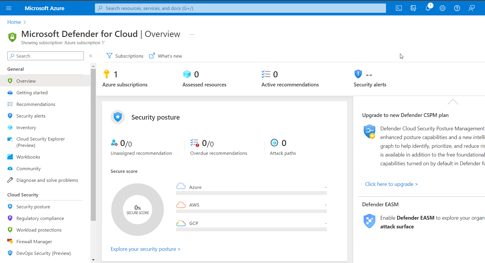

 #### INTRODUCTION 

In today’s fast-paced digital world, security has become a major concern for businesses that are moving to the cloud. Microsoft Azure provides a range of advanced security tools that can be used to secure your cloud environment. In this blog post, we will explore how you can use Azure Sentinel, Defender for Cloud, Azure Monitor, and Azure Advisor to enhance the security of your Azure cloud.

##### Azure Sentinel

Azure Sentinel is a cloud-native security information and event management (SIEM) tool that uses machine learning and AI to analyze data across your enterprise, including your cloud and on-premises environments. The tool helps you identify and respond to threats quickly and efficiently.

To use Azure Sentinel, you must first connect your data sources, such as Azure services, third-party services, or custom data sources, to the tool. Once your data sources are connected, Azure Sentinel will collect data and analyze it using machine learning algorithms. The tool uses advanced analytics to identify suspicious activities, such as malware infections, data exfiltration, and other security threats.

With Azure Sentinel, you can automate security tasks, such as incident response and threat hunting, and create custom dashboards to monitor your security posture.

##### Defender for Cloud

Azure Defender for Cloud is a cloud-native security tool that provides advanced threat protection for your Azure resources. The tool uses machine learning and AI to monitor your environment, providing real-time security alerts and recommendations for remediation.

Defender for Cloud provides a unified view of your environment, including virtual machines, containers, and serverless functions. The tool helps detect vulnerabilities and misconfigurations, and it can help you identify suspicious activities in your Azure resources.

With Defender for Cloud, you can protect your cloud environment against a wide range of threats, including malware, ransomware, and data exfiltration. The tool also integrates with Azure Security Center, enabling you to manage and monitor your security posture from a single dashboard.

##### Azure Monitor

Azure Monitor is a monitoring and logging service that provides a centralized view of your Azure resources. The tool helps you monitor the performance and health of your resources, including virtual machines, containers, and applications.

Azure Monitor collects data from your resources and provides real-time metrics, logs, and alerts. The tool enables you to set up custom alerts based on your specific requirements, helping you proactively identify and troubleshoot issues before they cause significant damage.

Azure Monitor also integrates with Azure Security Center, enabling you to monitor security events and alerts from a single dashboard.

##### Azure Advisor

Azure Advisor is a free Azure service that provides personalized recommendations to optimize your Azure resources. The tool analyzes your environment to identify potential problems and provides guidance on how to fix them.

Azure Advisor provides recommendations on a range of topics, including performance, security, cost optimization, and availability. This tool helps you ensure that your resources are configured correctly, are running optimally, and are cost-effective.

When it comes to security, Azure Advisor can help you identify potential security issues in your Azure resources. The tool provides recommendations on how to improve your security posture, such as enabling multi-factor authentication or configuring your network security group rules.

In conclusion, securing your Azure cloud environment is critical for protecting your data and mitigating risks. Azure Sentinel, Defender for Cloud, Azure Monitor, and Azure Advisor are powerful security tools that can help you enhance the security of your Azure cloud. By using these tools together, you can ensure that your cloud environment is secure and protected from emerging threats.