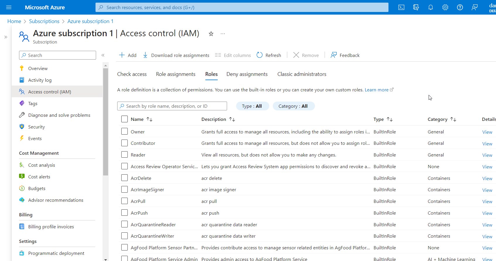
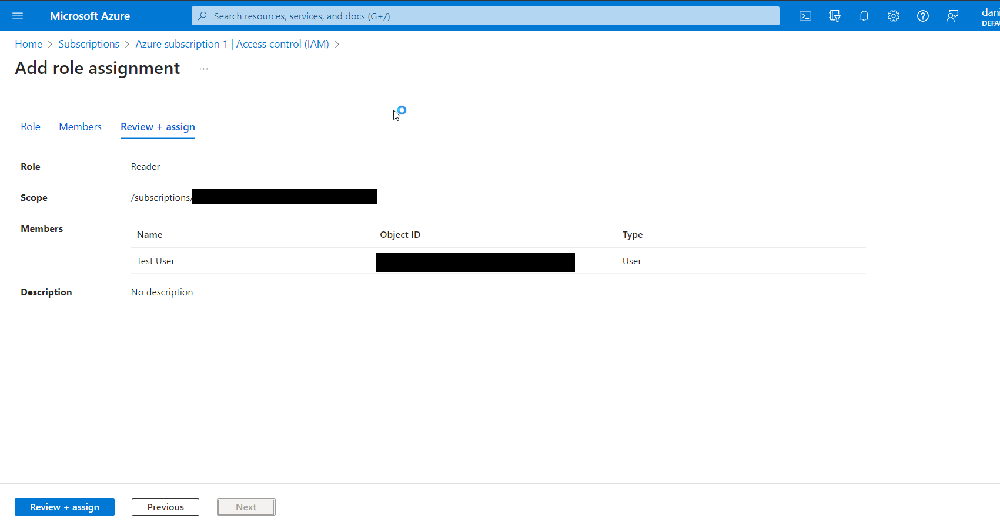

 #### INTRODUCTION 

 Azure Active Directory (Azure AD) is a cloud-based identity and access management (IAM) solution that provides organizations with the ability to control user access to various applications and resources in the cloud. Role-Based Access Control (RBAC) is a feature in Azure AD that allows administrators to manage access to resources based on the user's role within the organization.

In this blog post, we will discuss the Azure Active Directory Role-Based Access Control (RBAC) feature and how it works to manage access to resources.

##### Understanding Role-Based Access Control (RBAC):

Role-Based Access Control (RBAC) is a model that is used to control access to resources based on the user's role within an organization. In Azure AD, roles are defined by a set of permissions that determine what a user can or cannot do within an application or resource.

The RBAC model is based on three key components:

1. Roles: A role is a collection of permissions that define what actions a user can take within a resource. Azure AD provides a set of built-in roles, such as Owner, Contributor, and Reader, but administrators can also create custom roles that are specific to their organization.

2. Assignments: An assignment is the process of assigning a user or group to a role within a resource. Assignments can be made at the subscription, resource group, or individual resource level.

3. Scopes: A scope is the set of resources to which a role assignment applies. Scopes can be defined at the subscription, resource group, or individual resource level.

How Azure Active Directory Role-Based Access Control (RBAC) works:

In Azure AD, the RBAC model is used to manage access to various resources such as virtual machines, storage accounts, and databases. The following steps describe how Azure AD RBAC works:

1. Define roles: The first step is to define the roles that will be used to control access to resources. Azure AD provides a set of built-in roles, such as Owner, Contributor, and Reader, but administrators can also create custom roles that are specific to their organization. 

2. Define scopes: Once roles are defined or selected, the next step is to define scopes. Scopes can be defined at the subscription, resource group, or individual resource level. For example, an administrator may define a scope that includes all virtual machines within a particular resource group. 

3. Assign roles: The next step is to assign roles to users or groups. Assignments can be made at the subscription, resource group, or individual resource level.

4. Access resources: Users or groups with assigned roles can then access resources within the defined scope. Access is limited based on the permissions associated with the assigned role. 

##### Benefits of Azure Active Directory Role-Based Access Control (RBAC):

Azure Active Directory Role-Based Access Control (RBAC) provides several benefits, including:

1. Simplified access management: RBAC allows administrators to manage access to resources based on roles, making it easier to manage access to resources for a large number of users.

2. Improved security: RBAC helps improve security by limiting user access to only the resources that they need to perform their job functions. This helps reduce the risk of accidental or malicious changes to critical resources.

3. Flexibility: Azure AD RBAC allows for custom roles to be defined and assigned, giving organizations the flexibility to control access to resources based on their unique needs.

4. Auditing and compliance: RBAC provides detailed auditing capabilities that allow organizations to track who has access to resources and what actions they have taken. This helps organizations meet compliance requirements and ensures that access to resources is properly controlled.

##### Conclusion

In conclusion, Azure Active Directory Role-Based Access Control (RBAC) is a powerful feature that allows organizations to control access to resources based on the user's role within the organization. The RBAC model is based on roles, assignments, and scopes, and provides a flexible and scalable solution for managing access to resources in the cloud. With RBAC, administrators can simplify access management, improve security, and ensure compliance with industry regulations. By leveraging Azure AD RBAC, organizations can ensure that their cloud resources are properly secured and managed.

Thank you for reading, and don't hesitate reach out if you have any questions. 